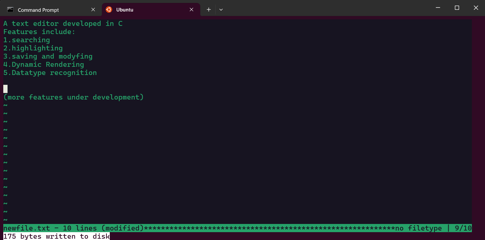

# TEXT-EDITOR

A terminal text editor built from scratch in C — no ncurses, no external dependencies. Just POSIX system calls, raw terminal I/O, and a dynamic rendering pipeline.



---

## Why

Most text editors are built on top of libraries like ncurses that abstract away terminal control. Sanju is built directly on top of POSIX terminal APIs — raw mode, ANSI escape sequences, and `read()`/`write()` — to understand what those abstractions are actually doing underneath.

---

## Features

- Open, edit, and save any text file
- Full cursor navigation — arrow keys, Home, End, Page Up, Page Down
- Wrapping cursor movement (← at line start jumps to end of previous line, → at line end jumps to start of next)
- Horizontal and vertical scrolling for files wider or longer than the terminal
- Tab expansion to 8-space-aligned tab stops in the render buffer, with correct cursor positioning
- Two-line status bar — filename, line count, modified flag, and cursor position
- Timed message bar — save confirmation and warnings auto-dismiss after 5 seconds
- Unsaved-change guard on quit — requires 3 consecutive `Ctrl+Q` presses if the file has been modified
- Create new files by passing a filename that doesn't exist yet
- Flicker-free rendering via a single-write append buffer

---

## Platform

**Linux / macOS / any POSIX-compliant Unix system.**

Not compatible with native Windows. On Windows, use [WSL](https://learn.microsoft.com/en-us/windows/wsl/about).

---

## Build

**Requirements:** `gcc`, `make`

```bash
git clone https://github.com/yourusername/TextEditor.git
cd TextEditor
make
```

To clean build artifacts:

```bash
make clean
```

The Makefile uses `-MMD` to generate `.d` dependency files, so incremental builds only recompile translation units whose headers have changed.

---

## Usage

**Open an existing file:**
```bash
./sanju path/to/file.txt
```

**Create a new file:**
```bash
./sanju newfile.txt
```

If the filename doesn't exist, the editor creates it on the first save.

---

## Keybindings

| Key | Action |
|---|---|
| `Ctrl+S` | Save file |
| `Ctrl+Q` | Quit (press 3× in a row if there are unsaved changes) |
| `Arrow keys` | Move cursor |
| `Home` | Jump to start of line |
| `End` | Jump to end of line |
| `Page Up` | Jump to top of current viewport |
| `Page Down` | Jump to bottom of current viewport |
| `Backspace` / `Ctrl+H` | Delete character to the left |
| `Delete` | Delete character to the right |
| `Enter` | Insert new line |

---

## Architecture

The project is split into five modules:

```
sanju.c              — Entry point. Holds the global EditorConfig.
rawmode.c/h          — Terminal raw mode, all struct definitions, die().
viewerfunctions.c/h  — Screen rendering, key input, cursor movement, scrolling.
editorfunctions.c/h  — Text manipulation: insert/delete characters and rows.
fileio.c/h           — File open/save, row lifecycle, tab expansion.
```

### Key design decisions

**Raw mode over ncurses** — The terminal's default canonical mode buffers input line-by-line and handles its own editing. Raw mode disables this so every keypress is received immediately and unmodified. Terminal state is saved on entry and restored via `atexit` on any exit path.

**Append buffer** — Every screen refresh accumulates all output (rows, status bar, cursor position) into a single heap buffer (`abuf`), then flushes it with one `write()` call. This prevents the partial-frame flickering that multiple small writes would cause.

**Dual cursor coordinates** — `cx/cy` track the cursor's logical position in the file's character array. `rx` tracks the visual column after tab expansion. These are kept separate because a tab character is one byte in `chars` but up to 8 spaces wide on screen — using `cx` directly for terminal cursor positioning would place the cursor at the wrong column on lines containing tabs.

**Two row buffers per line** — Each `erow` holds both `chars` (raw file content, tabs as `\t`) and `render` (display version, tabs expanded to aligned spaces). Edit operations work on `chars`; the screen draws from `render`. `EditorUpdateRow()` keeps them in sync after every change.

**`realloc` + `memmove` for in-place editing** — Character insertion grows the row's `chars` buffer with `realloc`, then uses `memmove` to shift existing characters right to open a slot. Deletion uses `memmove` to shift characters left to close the gap. `memmove` is used (not `memcpy`) because the source and destination regions overlap within the same buffer.

---

## Project Structure

```
TextEditor/
├── sanju.c                 # main()
├── rawmode.c / rawmode.h   # terminal control, data structures
├── viewerfunctions.c / .h  # rendering and input
├── editorfunctions.c / .h  # text manipulation
├── fileio.c / fileio.h     # disk I/O
├── Makefile
└── editor1.png             # screenshot
```

---

## Roadmap

- [ ] Incremental search (`Ctrl+F`)
- [ ] Syntax highlighting
- [ ] Line numbers
- [ ] Undo / redo
- [ ] Mouse support
